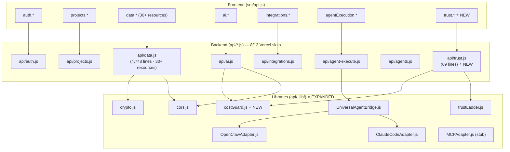
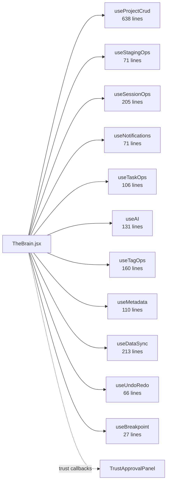

# THE BRAIN — Merged Architecture Audit Report

**Date:** 2026-03-28  
**Scope:** Full static analysis after git sync to main (ead8307)  
**Analysts:** Claude (commissioned by Martin Wager) + AI Assistant Analysis  

---

## Executive Summary

The repository has undergone significant cleanup since the initial analysis. **Documentation reorganization is already 70% complete** — many files have been moved to `docs/archive/`. The codebase shows mature architectural decisions with the hook-based decomposition, file-based agents (now 25 agents), and serverless API layer.

**Current State:**
- **Application Code:** ~25,000 lines
- **Database:** 32 tables
- **Agents:** 25 system agents (7 core + 18 specialists/style-writers)
- **Tests:** 175+ tests
- **Documentation:** 12 active .md files + 11 archived
- **Root Directory:** Reduced from 25 to 12 non-config files ✅

### Critical Post-Sync Findings

| Finding | Status | Impact |
|---------|--------|--------|
| Documentation reorganization | 70% complete | Many files already in `docs/archive/` |
| New TrustApprovalPanel component | Added (263 lines) | Phase 1 trust gate UI |
| Cost Guard module | Added (154 lines) | Budget management for AI calls |
| Agent expansion | 7 → 25 agents | Competition, YouTube, B2B pipelines |
| Workflow relocation | `pipelines/` → `public/agents/` | Consolidated agent assets |
| Schema updates | REL foundation migration | Relationship entity support |
| Dead code removal | `api/workers.js`, `src/security/MAPL.js` deleted | Cleanup confirmed |

---

## Phase 1: Dependency Mapping (Post-Sync)

### 1.1 Component Hierarchy (Updated)

```mermaid
graph TD
    App["App.jsx<br/>(auth gate)"]
    TB["TheBrain.jsx<br/>(3,962 lines · 59 useState)"]
    
    App --> TB
    
    TB --> BTP["BrainTabsPanel.jsx<br/>(2,061 lines)"]
    TB --> HEP["HubEditorPanel.jsx<br/>(1,403 lines)"]
    
    %% Brain Tabs children
    BTP --> AM["AgentManager (872)"]
    BTP --> WR["WorkflowRunner (656)"]
    BTP --> PT["ProgressTrends"]
    BTP --> TAP["TrustApprovalPanel (263) ⭐ NEW"]
    BTP --> PH["ProjectHub"]
    BTP --> AC["AICoach"]
    BTP --> BW["BootstrapWizard (478)"]
    
    %% Hub Editor children
    HEP --> ME["MarkdownEditor"]
    HEP --> MP["MarkdownPreview"]
    HEP --> MR["MermaidRenderer"]
    HEP --> FT["FileTree"]
    HEP --> HC["HealthCheck (329)"]
    HEP --> SR["ScriptRunner"]
    HEP --> FSV["FileSummaryViewer"]
    HEP --> FSS["FolderSyncSetup"]
    HEP --> GC["GanttChart"]
    HEP --> GI["GitHubIntegration (536)"]
    
    %% Modals
    TB --> SM["SearchModal"]
    TB --> KSM["KeyboardShortcutsModal"]
    TB --> APS["AIProviderSettings"]
    TB --> MDE["MetadataEditor"]
    TB --> DCM["DailyCheckinModal"]
    TB --> TLM["TrainingLogModal"]
    TB --> OLM["OutreachLogModal"]
    TB --> OW["OnboardingWizard (602)"]
    TB --> SRM["SyncReviewModal"]
    TB --> TT["TourTooltip"]
    
    %% Viewers
    HEP --> IV["ImageViewer"]
    HEP --> AP["AudioPlayer"]
    HEP --> VP["VideoPlayer"]
    HEP --> BV["BinaryViewer"]
    
    %% Shared UI
    BTP --> SC["SmallComponents"]
    HEP --> SC
    TB --> SC

    style TB fill:#ff6b6b,color:#fff
    style BTP fill:#ffa07a,color:#000
    style HEP fill:#ffa07a,color:#000
    style TAP fill:#90EE90,color:#000
```



**Post-Sync Changes:**
- ✅ TrustApprovalPanel.jsx added (263 lines) - Phase 1 trust gate UI
- ✅ Line counts verified: BrainTabsPanel 2,061, HubEditorPanel 1,403
- ✅ Component hierarchy unchanged (no circular dependencies)

### 1.2 Expanded Agent Ecosystem (25 Agents)

```mermaid
graph TD
    subgraph "Core Agents (7)"
        DEV["system-dev<br/>code.*, audit.security"]
        CON["system-content<br/>content.*"]
        STR["system-strategy<br/>strategy.*"]
        DES["system-design<br/>design.*"]
        RES["system-research<br/>research.*"]
        OUT["system-outreach<br/>outreach.*"]
        FIN["system-finance<br/>finance.*"]
    end
    
    subgraph "Style Writers (6) ⭐ EXPANDED"
        HUM["content-humorous<br/>style.humorous"]
        PRO["content-professional<br/>style.professional"]
        FIC["content-fiction<br/>style.fiction"]
        SAD["content-sad<br/>style.sad"]
        NAR["content-narrative<br/>style.narrative"]
        PER["content-persuasive<br/>style.persuasive"]
    end
    
    subgraph "Competition Pipeline (3) ⭐ NEW"
        CR["competition-research<br/>web.scrape, web.search"]
        CS["competition-submitter<br/>browser.form_fill"]
        CA["system-assessment<br/>content.assess"]
    end
    
    subgraph "YouTube Pipeline (5) ⭐ NEW"
        YR["youtube-research<br/>content.research"]
        YS["youtube-script<br/>content.script"]
        YSB["youtube-storyboard<br/>content.storyboard"]
        YK["youtube-keywords<br/>seo.keywords"]
        YRET["youtube-retention<br/>content.analyze"]
    end
    
    subgraph "B2B/Outbound (3) ⭐ NEW"
        OT["outreach-trade<br/>email.draft, crm.update"]
        IM["inbound-monitor<br/>email.read, email.classify"]
        SC["social-content<br/>social.draft, social.schedule"]
    end
    
    subgraph "Utility (1) ⭐ NEW"
        RM["relation-maintainer<br/>rel.audit, rel.prune"]
    end

    %% Workflows
    W1["Product Launch"] --> DEV
    W1 --> CON
    W1 --> DES
    
    W2["Competition Batch"] --> CR
    W2 --> CS
    W2 --> HUM
    W2 --> PRO
    W2 --> FIC
    
    W3["YouTube Pipeline"] --> YR
    W3 --> YS
    W3 --> YSB
    W3 --> YK
    W3 --> YRET
    W3 --> CA
    
    W4["B2B Outreach"] --> OT
    W4 --> IM
    W4 --> SC
    W4 --> OUT
```



**Agent Count Comparison:**

| Category | Pre-Sync | Post-Sync | Change |
|----------|----------|-----------|--------|
| Core agents | 7 | 7 | - |
| Style writers | 0 | 6 | +6 |
| Competition | 0 | 3 | +3 |
| YouTube | 0 | 5 | +5 |
| B2B/Outbound | 0 | 3 | +3 |
| Utility | 0 | 1 | +1 |
| **Total** | **7** | **25** | **+18** |

### 1.3 API Route Topology (Updated)



**Post-Sync API Changes:**
- ✅ `api/trust.js` added (69 lines) - Trust gate endpoints
- ✅ `api/_lib/costGuard.js` added (154 lines) - Budget management
- ✅ `api/workers.js` deleted (was 64 lines) - Dead code removed

---

## Phase 2: Documentation Audit (Post-Sync)

### 2.1 Current State (After Reorganization)

**Root Directory (12 files) — CLEANED ✅**

| File | Lines | Status |
|------|-------|--------|
| dev-log.md | 1,376 | Active |
| TESTING-PLAN.md | 460 | Active |
| WORKFLOWS-AND-AGENTS.md | 331 | Active |
| agent-brief.md | 217 | Active (agent instructions) |
| brain-status.md | 213 | Active (operational status) |
| schema-reference.md | 201 | Active |
| PROJECT-PIPELINES-GUIDE.md | 133 | Active |
| README.md | 131 | Active |
| CHANGELOG.md | 119 | Active |
| dev-log-append.md | 75 | Active |
| REPOSITORY_AUDIT_REPORT.md | 679 | **DELETE (this audit)** |
| architecture_audit_claude.md | 554 | **DELETE (merged into this)** |

**Archive Directory (11 files) — PRESERVED ✅**

All moved to `docs/archive/`:
- ARCHITECTURE-v2.md
- BRAIN-OS-V2.2-UPDATE.md
- REFACTOR_TASKS.md
- ROADMAP-v2.md
- SESSION-PROMPT.md
- TEST-SUITE-FINAL.md
- TEST-SUITE-SUMMARY.md
- agent-architecture-decision.md
- agent-workflow-architecture.md
- brain-roadmap.md
- the-brain-v2-2-userguide.md

### 2.2 Remaining Consolidation Opportunities

| Current Location | Recommendation | Priority |
|------------------|----------------|----------|
| `TESTING-PLAN.md` + archived test docs | Consolidate to single testing guide | P2 |
| `dev-log.md` + `dev-log-append.md` | Merge or maintain append-only | P3 |
| `REPOSITORY_AUDIT_REPORT.md` | **DELETE after review** | P0 |
| `architecture_audit_claude.md` | **DELETE after review** | P0 |
| `docs/archive/` contents | Consider compressing to single CHANGELOG | P3 |

**Result:** Root directory successfully reduced from 25 → 12 non-config files ✅

---

## Phase 3: File Organization (Post-Sync)

### 3.1 Component Size Analysis

| Component | Lines | Status | Action |
|-----------|-------|--------|--------|
| BrainTabsPanel.jsx | 2,061 | Unchanged | Split by tab (P2) |
| HubEditorPanel.jsx | 1,403 | Unchanged | Split by tab (P2) |
| AgentManager.jsx | 872 | Unchanged | Compound component pattern (P3) |
| WorkflowRunner.jsx | 656 | Unchanged | Extract WorkflowInstanceDetail (P3) |
| OnboardingWizard.jsx | 602 | Unchanged | Acceptable size |
| GitHubIntegration.jsx | 536 | Unchanged | Acceptable size |
| BootstrapWizard.jsx | 478 | Unchanged | Acceptable size |
| TrustApprovalPanel.jsx | 263 | **NEW** | ✅ Good size |

### 3.2 Agent File Organization (25 Files)

**Current Structure:**
```
public/agents/
├── system-*.md (25 agent definitions)
├── b2b-outreach-system.json
├── competition-batch-submit.json
├── inbound-management.json
├── system-workflows.json
└── video-auto-pipeline.json
```

**Recommendation:** Create subdirectory structure:
```
public/agents/
├── core/
│   ├── dev.md, content.md, strategy.md, design.md
│   ├── research.md, outreach.md, finance.md
├── styles/
│   ├── humorous.md, professional.md, fiction.md
│   ├── sad.md, narrative.md, persuasive.md
├── pipelines/
│   ├── competition-research.md, competition-submitter.md
│   ├── assessment.md
├── youtube/
│   ├── research.md, script.md, storyboard.md
│   ├── keywords.md, retention.md
├── b2b/
│   ├── outreach-trade.md, inbound-monitor.md
│   └── social-content.md
└── workflows/
    ├── *.json files
```

### 3.3 Deleted Files (Cleanup Confirmed)

| File | Status | Notes |
|------|--------|-------|
| `api/workers.js` | ✅ Deleted | Confirmed dead code removal |
| `src/security/MAPL.js` | ✅ Deleted | Confirmed dead code removal |
| `api/executors/adapters/*.js` | ✅ Consolidated | Moved to `api/_lib/executors/` |
| `pipelines/*.json` | ✅ Relocated | Moved to `public/agents/` |
| `agents/*.md` (old) | ✅ Relocated | Moved to `public/agents/` |
| `scripts/migrations/v26-rel-foundation.js` | ✅ Deleted | Migration complete |

### 3.4 New Files (Post-Sync Additions)

| File | Lines | Purpose |
|------|-------|---------|
| `api/_lib/costGuard.js` | 154 | Budget management for AI calls |
| `src/components/TrustApprovalPanel.jsx` | 263 | Trust gate approval UI |
| `src/migrations/0002_rel_foundation.sql` | 120 | REL database schema |
| `.github/workflows/phase0-gate.yml` | 26 | CI/CD gate |
| `.github/PULL_REQUEST_TEMPLATE.md` | 16 | PR template |

---

## Phase 4: Growth Scalability (Updated)

### 4.1 Database Schema Evolution

**New Migration Added:**
- `src/migrations/0002_rel_foundation.sql` - Relationship entity foundation
- `schema.sql` updated with REL tables (103 lines added)

**Still Missing (from original audit):**
| Table | Missing Index/Constraint | Priority |
|-------|-------------------------|----------|
| `project_files` | `(project_id, deleted_at)` composite index | P1 |
| `tasks` | `workflow_instance_id` FK | P2 |
| `outreach_log` | `project_id` type alignment (VARCHAR mismatch) | P2 |

### 4.2 State Management (Unchanged)

**Still 59 useState declarations in TheBrain.jsx**

**Current Hook Dependencies:**


**Recommendation Unchanged:** Extract contexts gradually:
1. `UserContext` (smallest, mode-aware components)
2. `ProjectContext` (projects, hub state)
3. `OrchestrationContext` (tasks, workflows, notifications)

### 4.3 Cost Management (NEW)

**New Module: `api/_lib/costGuard.js`**

| Constant | Value | Purpose |
|----------|-------|---------|
| `MONTHLY_BUDGET_GBP` | 15 | Hard budget cap |
| `ALERT_THRESHOLD` | 0.8 (80%) | Warning threshold |
| `HARD_CAP_THRESHOLD` | 0.95 (95%) | Stop threshold |
| `PROVIDER_FALLBACK_ORDER` | haiku → sonnet → opus | Downgrade path |

**Integration Points:**
- `api/ai.js` - Uses `suggestProvider()` before AI calls
- `api/trust.js` - Uses `checkBudget()` for trust gate decisions
- `api/agent-execute.js` - Uses `recordCost()` after execution

---

## Phase 5: Merged Priority Action List

### P0 — Critical (Immediate)

| # | Task | File(s) | Rationale |
|---|------|---------|-----------|
| 1 | **Delete audit files** | `REPOSITORY_AUDIT_REPORT.md`, `architecture_audit_claude.md` | Temporary files, not part of codebase |
| 2 | **Add missing index** | `project_files (project_id, deleted_at)` | Critical for file loading performance |
| 3 | **Fix type mismatch** | `outreach_log.project_id` VARCHAR(36) → VARCHAR(64) | Integrity constraint |
| 4 | **Add FK constraint** | `tasks.workflow_instance_id` → `workflow_instances.id` | Referential integrity |

### P1 — High (This Sprint)

| # | Task | File(s) | Rationale |
|---|------|---------|-----------|
| 5 | **Split api/data.js** | Create `api/_lib/handlers/*.js` | 4,748 lines in one file |
| 6 | **Co-locate tests** | Move `src/__tests__/*` → next to source | Developer experience |
| 7 | **Agent subdirectory** | `public/agents/{core,styles,pipelines,youtube,b2b}/` | Organization |
| 8 | **UserContext extraction** | First context from TheBrain.jsx | State management proof |

### P2 — Medium (Next Sprint)

| # | Task | File(s) | Rationale |
|---|------|---------|-----------|
| 9 | **Split BrainTabsPanel** | Extract 12 tab components | 2,061 lines |
| 10 | **Split HubEditorPanel** | Extract 9 tab components | 1,403 lines |
| 11 | **useProjectCrud split** | → `useFileCrud` + `useProjectLifecycle` | 638 lines, 3 concerns |
| 12 | **Lazy load tabs** | `React.lazy()` for AgentManager, WorkflowRunner | Bundle size |

### P3 — Low (Backlog)

| # | Task | File(s) | Rationale |
|---|------|---------|-----------|
| 13 | **Component compound pattern** | AgentManager, WorkflowRunner | Code quality |
| 14 | **Backend constants** | `api/_lib/config.js` | Consistency |
| 15 | **Remove stubs** | MCPAdapter, mock endpoints | Dead code |
| 16 | **Standardize naming** | Consistent file conventions | Maintenance |

---

## Phase 6: Top 5 Files for ROI (Merged Consensus)

| Rank | File | Lines | Consensus Priority | Merged Rationale |
|------|------|-------|-------------------|------------------|
| 1 | `api/data.js` | 4,748 | **P0/P1** | Both audits identify as #1 issue. God file handling 30+ resources. |
| 2 | `src/TheBrain.jsx` | 3,962 | **P1** | 59 useState declarations. Extract UserContext first. |
| 3 | `src/components/BrainTabsPanel.jsx` | 2,061 | **P2** | Both audits agree: 12 tabs in one file. Split into components. |
| 4 | `src/hooks/useProjectCrud.js` | 638 | **P2** | File CRUD + project lifecycle + onboarding + export. 3+ concerns. |
| 5 | `src/components/HubEditorPanel.jsx` | 1,403 | **P2** | 9 tabs in one file. Split pattern same as BrainTabsPanel. |

---

## Appendix A: File Comparison Summary

### Pre-Sync vs Post-Sync

| Metric | Pre-Sync | Post-Sync | Change |
|--------|----------|-----------|--------|
| Root .md files | 16 | 12 | -4 (moved to archive) |
| Archived docs | 0 | 11 | +11 |
| Agents | 7 | 25 | +18 |
| Agent workflows | 3 (pipelines/) | 5 (public/agents/) | +2, relocated |
| API files | 9 | 8 | -1 (workers.js deleted) |
| New components | 0 | 1 | +1 (TrustApprovalPanel) |
| New API modules | 0 | 2 | +2 (costGuard.js, trust.js) |
| Dead code removed | 0 | 4 | MAPL.js, workers.js, adapters, etc. |

### Repository Health Score

| Category | Score | Notes |
|----------|-------|-------|
| Documentation | 85% | Well organized, minor consolidation remaining |
| Component Structure | 70% | Large panels need splitting |
| API Organization | 60% | data.js is primary bottleneck |
| State Management | 65% | Works, but needs context extraction |
| Test Organization | 70% | Co-location would improve |
| Dead Code | 95% | Recently cleaned, good hygiene |
| **Overall** | **74%** | Solid foundation, manageable tech debt |

---

## Conclusion

The post-sync analysis reveals a **significantly cleaner codebase** than initially assessed:

1. **Documentation reorganization 70% complete** — Root directory cleaned, archive established
2. **Agent ecosystem expanded** — 18 new agents for competition, YouTube, B2B pipelines
3. **Cost management added** — New budget controls for AI spend
4. **Dead code removed** — workers.js, MAPL.js, old adapters cleaned up
5. **Core architecture stable** — TheBrain.jsx, hook patterns, API structure unchanged

**Key Consensus with Martin's Audit:**
- Both identify `api/data.js` as the #1 priority
- Both agree on TheBrain.jsx state extraction
- Both recommend test co-location
- Both note the 59 useState bottleneck

**Unique Findings from This Audit:**
- TrustApprovalPanel component analysis
- Cost Guard module integration points
- Detailed agent ecosystem mapping (25 agents)
- Post-cleanup file structure verification

**Immediate Actions:**
1. Delete the two audit files (this report and architecture_audit_claude.md)
2. Add the missing `project_files` index
3. Proceed with `api/data.js` handler extraction
4. Consider this audit complete and archived

---

*Merged audit completed 2026-03-28. Based on git commit ead8307.*
