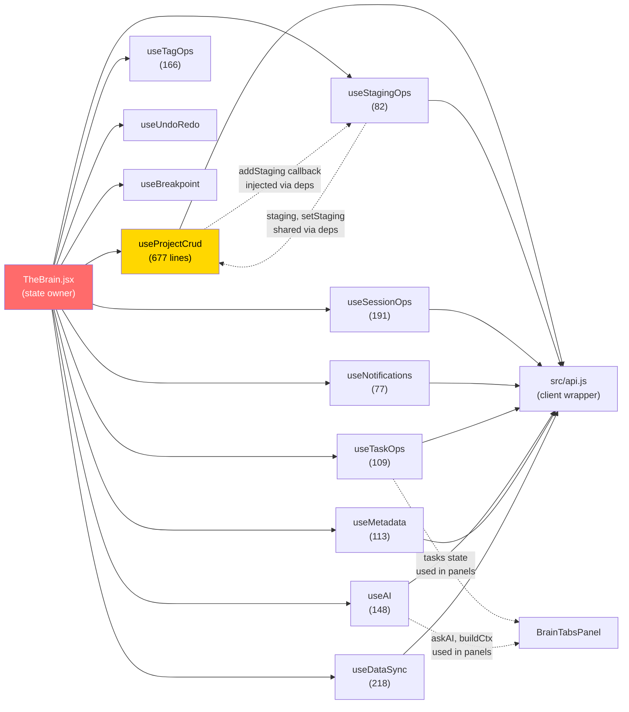
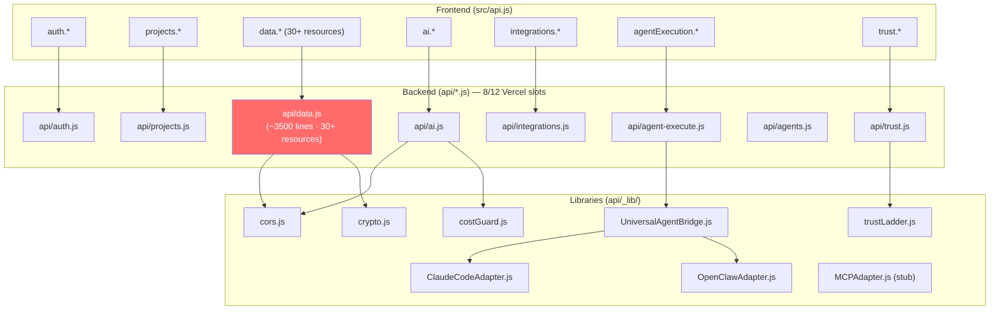

# THE BRAIN — Architecture Audit & Cleanup Report

**Date:** 2026-03-28  
**Scope:** Full static analysis of `martinw82/the-brain-2`  
**Analyst:** Claude (commissioned by Martin Wager)

---

## Executive Summary

The Brain is a substantial solo-built system (~25,000 lines of application code, 32 DB tables, 7 agents, 175+ tests) that has grown through rapid iteration. The architecture is sound at its core — the hook-based decomposition, file-based agents, and serverless API layer are good decisions. However, the codebase now shows classic "shipped fast, grew organically" symptoms: documentation sprawl (14 markdown files totalling ~15,000+ words of overlapping content), a root directory with 25 non-config files, prop-drilling through 59 useState declarations, and several dead-code paths from superseded features.

**The five highest-ROI refactors are:**

1. **Consolidate 14 .md files → 5** (eliminates contradictions, cuts maintenance burden by 60%)
2. **Extract TheBrain.jsx state into a context provider** (removes prop-drilling across 11 hooks)
3. **Split the monolithic `api/data.js`** (currently ~3,500+ lines handling 30+ resource types)
4. **Co-locate tests with source files** (reduces cognitive load when editing)
5. **Move 15 root .md files into `/docs`** (cleans root to essentials only)

---

## Phase 1: Dependency Mapping

### 1.1 Component Hierarchy

```mermaid
graph TD
    App["App.jsx<br/>(auth gate)"]
    TB["TheBrain.jsx<br/>(3,962 lines · 59 useState)"]
    
    App --> TB
    
    TB --> BTP["BrainTabsPanel.jsx<br/>(2,150 lines)"]
    TB --> HEP["HubEditorPanel.jsx<br/>(1,480 lines)"]
    
    %% Brain Tabs children
    BTP --> AM["AgentManager (916)"]
    BTP --> WR["WorkflowRunner (687)"]
    BTP --> PT["ProgressTrends"]
    BTP --> TAP["TrustApprovalPanel"]
    BTP --> PH["ProjectHub"]
    BTP --> AC["AICoach"]
    BTP --> BW["BootstrapWizard (480)"]
    
    %% Hub Editor children
    HEP --> ME["MarkdownEditor"]
    HEP --> MP["MarkdownPreview"]
    HEP --> MR["MermaidRenderer"]
    HEP --> FT["FileTree"]
    HEP --> HC["HealthCheck (342)"]
    HEP --> SR["ScriptRunner (302)"]
    HEP --> FSV["FileSummaryViewer"]
    HEP --> FSS["FolderSyncSetup"]
    HEP --> GC["GanttChart"]
    HEP --> GI["GitHubIntegration (561)"]
    
    %% Modals (launched from TheBrain)
    TB --> SM["SearchModal"]
    TB --> KSM["KeyboardShortcutsModal"]
    TB --> APS["AIProviderSettings"]
    TB --> MDE["MetadataEditor"]
    TB --> DCM["DailyCheckinModal"]
    TB --> TLM["TrainingLogModal"]
    TB --> OLM["OutreachLogModal"]
    TB --> OW["OnboardingWizard (632)"]
    TB --> SRM["SyncReviewModal"]
    TB --> TT["TourTooltip"]
    
    %% Viewers
    HEP --> IV["ImageViewer"]
    HEP --> AP["AudioPlayer"]
    HEP --> VP["VideoPlayer"]
    HEP --> BV["BinaryViewer"]
    
    %% Shared UI
    BTP --> SC["SmallComponents<br/>(AreaPill, TagPill, Dots,<br/>HealthBar, Modal, Toast)"]
    HEP --> SC
    TB --> SC

    style TB fill:#ff6b6b,color:#fff
    style BTP fill:#ffa07a,color:#000
    style HEP fill:#ffa07a,color:#000
```



**Key findings:**

- **No circular dependencies** between components. The hierarchy is strictly top-down.
- **Prop-drilling depth = 3** (TheBrain → Panel → Child component). The `ctx` pattern mitigates this somewhat, but `ctx` objects contain 40+ properties each.
- **5 components exceed 500 lines** (candidates for further decomposition): AgentManager (916), WorkflowRunner (687), OnboardingWizard (632), GitHubIntegration (561), BootstrapWizard (480).

### 1.2 Hook Dependency Web



**Key findings:**

- **No circular hook dependencies.** The `deps` pattern enforces unidirectional flow.
- **useStagingOps must be called before useProjectCrud** (documented in REFACTOR_TASKS.md) — this ordering constraint is fragile and should be explicitly enforced.
- **useProjectCrud is the heaviest hook** (677 lines) — it handles project CRUD, file ops, onboarding, bootstrap, drag-and-drop, and export. Candidate for splitting into `useFileCrud` + `useProjectLifecycle`.
- **All 11 hooks receive deps from TheBrain.jsx's 59 useState declarations.** This is the primary architectural bottleneck for scaling.

### 1.3 API Route Topology



**Key findings:**

- **`api/data.js` is a God file** (~3,500+ lines). It routes 30+ resource types through a single handler via `req.query.resource` switching. Resources include: staging, ideas, sessions, comments, file-metadata, areas, goals, templates, tags, entity-tags, entity-links, search, daily-checkins, training-logs, outreach-log, weekly-reviews, ai-metadata-suggestions, sync-state, scripts, drift-check, notifications, notification-check, mode-suggestions, dismiss-mode-suggestion, export-all, import-all, user-ai-settings, tasks, file-summaries, workflows, workflow-instances, auto-tasks, create-from-proposed, workflow-patterns, apply-workflow-suggestion, memories, extract-memories, memory-insights, community-workflows, community-workflow-action, my-community-workflows, integrations, github-sync, calendar-sync, email-sync, integration-sync-log, agent-stats, wipe-user-data.
- **Orphaned/stub endpoints:** `MCPAdapter.js` is a complete stub. `calendar-sync`, `email-sync`, and `github-sync` resources in `api/data.js` return mock data (marked "In production, would call...").
- **4 remaining Vercel serverless function slots** (8 used of 12 limit). This constraint means any new API files must be consolidated into existing routes.
- **No transaction batching** anywhere. Each resource handler makes 1-8 sequential queries. The `import-all` endpoint makes N queries per table (one per row) with no batch insert.

### 1.4 Agent Capability Flow

```mermaid
graph TD
    subgraph "Capability Providers (Agents)"
        DEV["system-dev-v1<br/>code.write, .review, .debug,<br/>.test, .deploy, audit.security"]
        CON["system-content-v1<br/>content.write, .edit,<br/>.social, .email, .docs"]
        STR["system-strategy-v1<br/>strategy.plan, .research,<br/>.analyze, .prioritize"]
        DES["system-design-v1<br/>design.ui, .assets,<br/>.brand, .prototype"]
        RES["system-research-v1<br/>research.market, .tech,<br/>.competitor, .user"]
        OUT["system-outreach-v1<br/>outreach.find, .write, .track"]
        FIN["system-finance-v1<br/>finance.analyze, .price, .report"]
    end

    subgraph "Style Writers (Competition Pipeline)"
        HUM["system-content-humorous-v1<br/>style.humorous"]
        PRO["system-content-professional-v1<br/>style.professional"]
        FIC["system-content-fiction-v1<br/>style.fiction"]
        SAD["system-content-sad-v1<br/>style.sad"]
        NAR["system-content-narrative-v1<br/>style.narrative"]
        PER["system-content-persuasive-v1<br/>style.persuasive"]
    end

    subgraph "Specialist Agents"
        CR["system-competition-research-v1<br/>web.scrape, web.search, data.extract"]
        CS["system-competition-submitter-v1<br/>browser.form_fill, browser.screenshot"]
        OT["system-outreach-trade-v1<br/>email.draft, crm.update"]
        IM["system-inbound-monitor-v1<br/>email.read, email.classify"]
        SC["system-social-content-v1<br/>social.draft, social.schedule"]
        YR["system-youtube-research-v1<br/>web.search, data.extract"]
        YS["system-youtube-script-v1<br/>content.script"]
        YSB["system-youtube-storyboard-v1<br/>content.storyboard"]
        YK["system-youtube-keywords-v1<br/>seo.keywords"]
        YRE["system-youtube-retention-v1<br/>content.analyze"]
        YA["system-assessment-v1<br/>content.assess, quality.score"]
        RM["relation-maintainer<br/>rel.audit, rel.prune"]
    end

    subgraph "Workflow Consumers"
        W1["Product Launch<br/>needs: code.review, audit.security,<br/>design.assets, content.write,<br/>code.deploy, content.social, code.debug"]
        W2["Competition Batch Submit<br/>needs: web.scrape, data.extract,<br/>content.write, browser.form_fill"]
        W3["B2B Outreach<br/>needs: outreach.find, email.draft,<br/>content.write, email.read"]
        W4["YouTube Pipeline<br/>needs: content.research, content.script,<br/>content.storyboard, seo.keywords,<br/>content.assess"]
    end

    DEV -.-> W1
    CON -.-> W1
    DES -.-> W1
    
    CR -.-> W2
    HUM -.-> W2
    PRO -.-> W2
    FIC -.-> W2
    CS -.-> W2
    
    OUT -.-> W3
    OT -.-> W3
    IM -.-> W3
    
    YR -.-> W4
    YS -.-> W4
    YSB -.-> W4
    YK -.-> W4
    YRE -.-> W4
    YA -.-> W4
```



**Key findings:**

- **Capability overlap:** `system-content-v1` declares `content.write` AND all 6 style writers declare `content.write`. When a workflow step requests `content.write`, the router could match any of 7 agents. The style writers should use unique capabilities (`style.humorous`, etc.) and the competition workflow already routes by `routing_rules`, not by capability match — so the overlap is benign but confusing.
- **Unused agents:** `system-finance-v1` and `system-outreach-v1` have no workflow consumers. They're only reachable via manual task assignment.
- **`relation-maintainer`** is defined but has no execution path — it references `pruneOrphans(db, 48)` which requires a direct DB connection, not available through the current agent execution flow (agents call the AI API, not DB directly).

---

## Phase 2: Documentation Audit

### 2.1 Full Inventory

| File | Category | Word Count (est.) | Last Referenced | Overlap With |
|------|----------|-------------------|-----------------|--------------|
| `README.md` | User guide | ~1,800 | Active | ARCHITECTURE-v2, agent-brief |
| `ARCHITECTURE-v2.md` | Architecture | ~3,200 | Active | README (duplicates stack table, module map) |
| `brain-status.md` | Operational | ~4,500 | Active | brain-roadmap (duplicates phase status) |
| `brain-roadmap.md` | Process | ~3,800 | Active | brain-status (duplicates phase status), ROADMAP-v2 |
| `ROADMAP-v2.md` | Process | ~3,500 | Active | brain-roadmap (near-complete duplicate) |
| `agent-brief.md` | Operational | ~2,200 | Active | ARCHITECTURE-v2 (duplicates orchestration layer) |
| `agent-architecture-decision.md` | Architecture | ~2,800 | Historical | agent-workflow-architecture |
| `agent-workflow-architecture.md` | Architecture | ~4,000 | Historical | agent-architecture-decision, WORKFLOWS-AND-AGENTS |
| `WORKFLOWS-AND-AGENTS.md` | User guide | ~3,200 | Active | agent-workflow-architecture |
| `PROJECT-PIPELINES-GUIDE.md` | User guide | ~2,000 | Active | (unique) |
| `the-brain-v2-2-userguide.md` | User guide | ~5,500 | Active | README, WORKFLOWS-AND-AGENTS, PROJECT-PIPELINES-GUIDE |
| `BRAIN-OS-V2.2-UPDATE.md` | Operational | ~1,800 | Historical | brain-status |
| `SESSION-PROMPT.md` | Operational | ~800 | Historical (superseded bugs) | brain-status §6 |
| `REFACTOR_TASKS.md` | Process | ~1,200 | Complete | (unique) |
| `TESTING-PLAN.md` | Process | ~3,000 | Active | TEST-SUITE-SUMMARY, TEST-SUITE-FINAL |
| `TEST-SUITE-SUMMARY.md` | Process | ~1,500 | Active | TESTING-PLAN, TEST-SUITE-FINAL |
| `TEST-SUITE-FINAL.md` | Process | ~1,800 | Active | TESTING-PLAN, TEST-SUITE-SUMMARY |
| `schema-reference.md` | Architecture | ~2,000 | Partially stale | schema.sql |
| `dev-log.md` | Operational | ~8,000 | Active | (unique, append-only) |

**Total: 19 markdown files, ~55,000+ estimated words.**

### 2.2 Redundancy Map

| Content | Appears In | Winner |
|---------|-----------|--------|
| Stack overview table | README, ARCHITECTURE-v2, brain-status | README (keep shortest) |
| Module map / file locations | README, ARCHITECTURE-v2, agent-brief | README (canonical) |
| Phase completion status | brain-roadmap, brain-status, ROADMAP-v2, BRAIN-OS-V2.2-UPDATE | brain-roadmap (single source) |
| Orchestration flow diagram | ARCHITECTURE-v2, agent-brief, ROADMAP-v2 | ARCHITECTURE-v2 |
| Agent file format spec | agent-architecture-decision, WORKFLOWS-AND-AGENTS, agent-brief | WORKFLOWS-AND-AGENTS |
| Workflow execution model | agent-workflow-architecture, WORKFLOWS-AND-AGENTS | WORKFLOWS-AND-AGENTS |
| Testing inventory | TESTING-PLAN, TEST-SUITE-SUMMARY, TEST-SUITE-FINAL | TESTING-PLAN (merge all) |
| Hook wiring pattern | README, agent-brief, ARCHITECTURE-v2 | README |
| Trust ladder spec | BRAIN-OS-V2.2-UPDATE, PROJECT-PIPELINES-GUIDE | PROJECT-PIPELINES-GUIDE |

### 2.3 Consolidation Plan

**Target: 19 files → 7 files**

```
/docs/
├── architecture.md        ← ARCHITECTURE-v2 + schema-reference (merged)
├── user-guide.md          ← the-brain-v2-2-userguide (canonical, absorbs README user sections)
├── workflows-and-agents.md ← WORKFLOWS-AND-AGENTS + PROJECT-PIPELINES-GUIDE (merged)
├── development.md         ← TESTING-PLAN + TEST-SUITE-FINAL + TEST-SUITE-SUMMARY (merged)
├── decisions/
│   ├── agent-architecture.md  ← agent-architecture-decision + agent-workflow-architecture (archive)
│   └── brain-os-v2.2.md      ← BRAIN-OS-V2.2-UPDATE (archive)
├── changelog.md           ← dev-log.md (renamed, keep append-only)
└── roadmap.md             ← brain-roadmap (sole roadmap, delete ROADMAP-v2)

/root (keep):
├── README.md              ← Rewrite: 80 lines max, links to /docs/
├── agent-brief.md         ← Keep (agent operating instructions, remove duplicated sections)
└── brain-status.md        ← Keep (operational, remove duplicated phase tracking)

/root (delete or archive to /docs/decisions/):
├── SESSION-PROMPT.md      ← DELETE (superseded, bugs fixed)
├── REFACTOR_TASKS.md      ← ARCHIVE to /docs/decisions/ (completed)
```

---

## Phase 3: File Organization Analysis

### 3.1 Root Directory Audit

**Current root: 25 non-config files + 9 config files = 34 files total.**

| Keep in Root | Move to /docs | Move to /config | Delete |
|---|---|---|---|
| README.md | agent-architecture-decision.md | agent-config.json | SESSION-PROMPT.md |
| package.json | agent-workflow-architecture.md | | |
| index.html | ARCHITECTURE-v2.md | | |
| vercel.json | BRAIN-OS-V2.2-UPDATE.md | | |
| schema.sql | brain-roadmap.md | | |
| seed-projects.js | ROADMAP-v2.md | | |
| agent-brief.md | REFACTOR_TASKS.md | | |
| brain-status.md | schema-reference.md | | |
| dev-log.md | TESTING-PLAN.md | | |
| | TEST-SUITE-SUMMARY.md | | |
| | TEST-SUITE-FINAL.md | | |
| | PROJECT-PIPELINES-GUIDE.md | | |
| | the-brain-v2-2-userguide.md | | |
| | WORKFLOWS-AND-AGENTS.md | | |

**Result: Root drops from 25 non-config files to 9.**

### 3.2 Component Analysis

**Components >500 lines (compound component candidates):**

| Component | Lines | Suggestion |
|---|---|---|
| AgentManager.jsx | 916 | Split into AgentList + AgentDetail + AgentEditor |
| WorkflowRunner.jsx | 687 | Already has `WorkflowInstanceDetail` internally — extract it |
| OnboardingWizard.jsx | 632 | Extract each step into a sub-component |
| GitHubIntegration.jsx | 561 | Extract ConnectModal + RepoCard + CommitList |
| BootstrapWizard.jsx | 480 | Acceptable size, but each step could be extracted |

### 3.3 Test File Placement

**Current:** Tests in `src/__tests__/` mirroring source structure.  
**Issue:** When editing `src/uri.js`, the test is at `src/__tests__/utils/uri.test.js` — two directory traversals away.

**Recommendation:** Co-locate tests with source files.

| Current | Recommended |
|---|---|
| `src/__tests__/utils/uri.test.js` | `src/uri.test.js` |
| `src/__tests__/agents.test.js` | `src/agents.test.js` |
| `src/__tests__/entityGraph.test.js` | `src/entityGraph.test.js` |
| `src/__tests__/hooks/useUndoRedo.test.js` | `src/hooks/useUndoRedo.test.js` |
| `src/__tests__/components/UI/SmallComponents.test.jsx` | `src/components/UI/SmallComponents.test.jsx` |

**Jest config change:** Update `testMatch` pattern from `src/__tests__/**` to `src/**/*.test.{js,jsx}`.

### 3.4 Agent File Organization

**Current:** All agents in `public/agents/` (system + workflow templates + user-created).

**Recommendation:**
```
public/agents/
├── system/              ← System agent definitions (read-only)
│   ├── dev.md
│   ├── content.md
│   ├── strategy.md
│   ├── design.md
│   ├── research.md
│   ├── outreach.md
│   ├── outreach-trade.md
│   ├── finance.md
│   ├── inbound-monitor.md
│   ├── social-content.md
│   ├── relation-maintainer.md
│   └── ...style writers, youtube agents, etc.
├── workflows/           ← Workflow pipeline definitions
│   ├── system-workflows.json
│   ├── b2b-outreach-system.json
│   ├── competition-batch-submit.json
│   ├── inbound-management.json
│   └── video-auto-pipeline.json
└── custom/              ← User-created agents (future)
```

**Impact:** `src/agents.js` `loadSystemAgents()` would need path updates (currently hardcoded file list).

### 3.5 Configuration Sprawl

**Hardcoded constants that should be in `src/utils/constants.js`:**

| Location | Constant | Current Value |
|---|---|---|
| `api/_lib/costGuard.js` | MONTHLY_BUDGET_GBP | 15 |
| `api/_lib/costGuard.js` | PROVIDER_FALLBACK_ORDER | Array |
| `api/_lib/trustLadder.js` | Promotion thresholds | Inline numbers |
| `api/data.js` | RATE_LIMIT_WINDOW | 60000 |
| `api/data.js` | RATE_LIMIT_MAX | 30 |
| `src/agents.js` | CACHE_TTL | 60000 |
| `src/sync.js` | NETWORK_CHECK_INTERVAL | 5000 |
| `src/sync.js` | RETRY_DELAYS | [1000, 2000, 4000, 8000, 16000] |

**Note:** Backend constants should stay in backend files (not shared with frontend). But they should be extracted to a shared `api/_lib/config.js` for consistency.

### 3.6 Dead Code / Stubs

| File | Issue |
|---|---|
| `api/_lib/executors/MCPAdapter.js` | Complete stub — `canHandle()` always returns false |
| `api/_lib/executors/OpenClawAdapter.js` | Stub — logs intent, returns mock |
| `api/data.js` calendar-sync | Returns mock data ("In production, would create...") |
| `api/data.js` email-sync | Returns mock data |
| `api/data.js` github-sync (partial) | Some endpoints return mock data |
| `src/components/Editor.jsx` | Has duplicate `fileMetadata` prop in signature |
| `scripts/migrate.js.backup` | Backup of old migration script — should be deleted or gitignored |
| `src/db/index.ts` + `src/db/schema.ts` | Drizzle ORM setup, but all actual queries use raw mysql2. Drizzle is unused. |
| `drizzle.config.ts` | Drizzle config for unused ORM |

---

## Phase 4: Growth Scalability Assessment

### 4.1 State Management

**Current:** 59 `useState` declarations in TheBrain.jsx, passed to 11 hooks via `deps` objects.

**Analysis:**

The `deps` pattern works at current scale but creates three problems as the app grows:

1. **Re-render cascade:** Any state change re-renders TheBrain.jsx, which re-renders both panels (even if only one needs the update).
2. **Deps object maintenance:** Adding a new state variable requires updating TheBrain.jsx AND the relevant hook's deps destructuring AND the panel's ctx prop.
3. **Testing complexity:** Hooks can only be tested by mocking the entire deps object.

**Recommendation:** Introduce a lightweight context layer — NOT a full Redux/Zustand migration. Use React Context to group related state:

```
BrainStateProvider
├── ProjectContext     (projects, hubId, hub, activeFile)
├── UIContext          (mainTab, hubTab, isMobile, modals)
├── UserContext        (user, settings, mode)
├── SessionContext     (sessionStart, focusId, timer)
└── OrchestrationContext (tasks, workflows, notifications)
```

**Migration path:** Extract one context at a time. Start with `UserContext` (smallest surface area, used by all mode-aware components). This is a P2 refactor — the current system works, it just doesn't scale gracefully past ~70 state variables.

### 4.2 Database Schema

**Missing indexes (will matter at scale):**

| Table | Column(s) | Query Pattern | Priority |
|---|---|---|---|
| `project_files` | `(project_id, deleted_at)` | Soft-delete filtering (every file load) | P0 |
| `tasks` | `(workflow_instance_id)` | Workflow step completion lookups | P1 |
| `staging` | `(user_id, project_id, status)` | Project staging list with status filter | P1 |
| `ideas` | `(user_id, score)` | Sorted idea bank | P2 |
| `sessions` | `(user_id, project_id, created_at)` | Recent sessions per project | P1 |
| `daily_checkins` | Already indexed | — | OK |
| `rel_entities` | Already indexed | — | OK |

**Missing foreign key constraints:**

| Table | Column | Should Reference |
|---|---|---|
| `tasks.workflow_instance_id` | `workflow_instances.id` | Missing FK |
| `outreach_log.project_id` | `projects.id` | FK declared as VARCHAR(36) but projects.id is VARCHAR(64) — type mismatch |
| `memories` | No FK to users in migration v26 | FK exists in schema.sql but not in migrate.js |

**Duplicate migration:** Migration v26 (create_memories_table) appears THREE TIMES in `scripts/migrate.js.backup`. The live `scripts/migrate.js` should be verified to only have it once.

### 4.3 Build Performance

**Current bundle:** 493KB (144KB gzipped) — acceptable.

**Lazy-load candidates:**

| Module | Est. Size | Load Condition |
|---|---|---|
| Mermaid (CDN) | ~800KB | Only when viewing .md with mermaid blocks |
| AgentManager | ~30KB | Only on Skills tab |
| WorkflowRunner | ~25KB | Only on Workflows tab |
| GitHubIntegration | ~20KB | Only on Integrations tab |
| OnboardingWizard | ~22KB | Only on first login |

**Recommendation:** Use `React.lazy()` + `Suspense` for tab-level code splitting:

```javascript
const AgentManager = React.lazy(() => import('./components/AgentManager'));
const WorkflowRunner = React.lazy(() => import('./components/WorkflowRunner'));
```

This would reduce initial bundle by ~100KB (estimated).

### 4.4 API Splitting Strategy

`api/data.js` needs to be split, but the Vercel 12-function limit constrains this. Strategy:

**Current 8 functions → keep at 8, restructure internally:**

| Function | Resources |
|---|---|
| `api/auth.js` | auth (keep) |
| `api/projects.js` | projects, files, folders (keep) |
| `api/data.js` | **Split internally into handler modules in `api/_lib/handlers/`** |
| `api/ai.js` | AI proxy (keep) |
| `api/agents.js` | agent execution (keep) |
| `api/agent-execute.js` | function calling (keep) |
| `api/integrations.js` | external integrations (keep) |
| `api/trust.js` | trust gates (keep) |

The `api/data.js` handler functions should be extracted into `api/_lib/handlers/`:
```
api/_lib/handlers/
├── staging.js
├── tasks.js
├── workflows.js
├── checkins.js
├── notifications.js
├── memories.js
├── community.js
└── settings.js
```

Each handler exports a function; `api/data.js` becomes a thin router that dispatches to the appropriate handler. This preserves the single Vercel function while making the code maintainable.

---

## Deliverables

### Reorganization Script

```bash
#!/bin/bash
# THE BRAIN — Repository Reorganization
# Run from repository root. Uses git mv to preserve history.

# 1. Create /docs structure
mkdir -p docs/decisions

# 2. Move documentation files (preserve git history)
git mv ARCHITECTURE-v2.md docs/architecture.md
git mv schema-reference.md docs/schema-reference.md
git mv ROADMAP-v2.md docs/decisions/roadmap-v2-archived.md
git mv agent-architecture-decision.md docs/decisions/agent-architecture.md
git mv agent-workflow-architecture.md docs/decisions/agent-workflow-architecture.md
git mv BRAIN-OS-V2.2-UPDATE.md docs/decisions/brain-os-v2.2.md
git mv REFACTOR_TASKS.md docs/decisions/refactor-tasks-completed.md
git mv TEST-SUITE-SUMMARY.md docs/decisions/test-suite-summary.md
git mv TEST-SUITE-FINAL.md docs/decisions/test-suite-final.md
git mv the-brain-v2-2-userguide.md docs/user-guide.md
git mv WORKFLOWS-AND-AGENTS.md docs/workflows-and-agents.md
git mv PROJECT-PIPELINES-GUIDE.md docs/project-pipelines.md
git mv TESTING-PLAN.md docs/development.md

# 3. Delete superseded files
git rm SESSION-PROMPT.md
git rm scripts/migrate.js.backup

# 4. Move agent-config to config location
mkdir -p config
git mv agent-config.json config/agent-config.json

# 5. Update .gitignore
echo "" >> .gitignore
echo "# Build artifacts" >> .gitignore
echo "dev_server.log" >> .gitignore

# 6. Commit
git add -A
git commit -m "refactor: reorganize docs and clean root directory

- Move 14 .md files to /docs/ and /docs/decisions/
- Delete superseded SESSION-PROMPT.md
- Delete migrate.js.backup
- Move agent-config.json to /config/
- Root directory reduced from 25 to 9 non-config files"
```

### Priority Action List

**P0 — Critical (do first):**

1. **Delete `scripts/migrate.js.backup`** — contains triplicate migration v26 and stale code
2. **Fix `outreach_log.project_id` type mismatch** — VARCHAR(36) vs projects.id VARCHAR(64)
3. **Add missing index on `project_files (project_id, deleted_at)`** — every file load queries this
4. **Remove duplicate `fileMetadata` prop in `Editor.jsx` signature** — will cause React warning

**P1 — High (this sprint):**

5. **Consolidate documentation** — run the reorganization script above
6. **Split `api/data.js` into handler modules** — extract to `api/_lib/handlers/`
7. **Add `tasks.workflow_instance_id` FK** — integrity constraint for workflow execution
8. **Co-locate test files** — move tests next to source, update jest config

**P2 — Medium (next sprint):**

9. **Extract `UserContext` from TheBrain.jsx** — first step toward context-based state
10. **Split `useProjectCrud`** into `useFileCrud` + `useProjectLifecycle`
11. **Extract `WorkflowInstanceDetail`** from WorkflowRunner.jsx (already defined inline)
12. **Lazy-load tab-level components** (AgentManager, WorkflowRunner, GitHubIntegration)
13. **Remove unused Drizzle ORM** — delete `src/db/`, `drizzle.config.ts`, remove drizzle deps from package.json
14. **Reorganize `public/agents/`** into system/workflows/custom subdirectories

**P3 — Low (backlog):**

15. **Extract backend constants** to `api/_lib/config.js`
16. **Remove dead stubs** (MCPAdapter, OpenClawAdapter mock returns, calendar/email mock endpoints)
17. **Rename `scripts/migrate.js`** migrations to use numbered prefix files (like `src/migrations/`)
18. **Add AbortController** to `useMetadata` (documented race condition)
19. **Standardize file naming** — some components use PascalCase.jsx, hooks use camelCase.js (consistent, keep as-is)

### Top 5 Files for Highest Maintainability ROI

| Rank | File | Lines | Why |
|---|---|---|---|
| 1 | `api/data.js` | ~3,500 | Single largest source of complexity. Splitting into handlers makes every resource independently testable and reviewable. |
| 2 | `src/TheBrain.jsx` | 3,962 | 59 useState declarations are the bottleneck. Extracting even one context (UserContext) proves the pattern. |
| 3 | `src/hooks/useProjectCrud.js` | 677 | Mixes file CRUD, project lifecycle, onboarding, bootstrap, drag-drop, and export. At least 3 concerns. |
| 4 | `src/components/AgentManager.jsx` | 916 | Largest component. List/detail/editor pattern is a textbook compound component extraction. |
| 5 | `README.md` | ~1,800 | Currently duplicates content from 4 other docs. Rewriting to 80 lines with links to /docs/ eliminates the maintenance multiplier. |

### Scalability Recommendations

**State management:** Don't migrate to Zustand/Redux. The current hook-based approach is fine with React Context added as a middle layer. Extract `UserContext` first (proves the pattern), then `ProjectContext`, then `OrchestrationContext`. Each extraction is independently shippable.

**Module boundaries for future splitting:** If the app ever needs to split into micro-frontends, the natural boundaries are:
- **Brain shell** (navigation, auth, settings) — `TheBrain.jsx` + `App.jsx` + `AuthScreen.jsx`
- **Project workspace** (hub view) — `HubEditorPanel` + all viewer/editor components
- **Orchestration** (tasks, workflows, agents) — `BrainTabsPanel` subset + `AgentManager` + `WorkflowRunner`
- **Daily ops** (checkins, training, outreach) — modal components + `useSessionOps`

**Database indexing for 10x growth:** Add the 4 indexes from §4.2. At 10x scale, also add:
- Composite index on `tasks (user_id, status, priority)` for sorted task lists
- Composite index on `workflow_instances (user_id, status)` for running workflow queries  
- Consider partitioning `sessions` and `daily_checkins` by date (monthly partitions)

---

*End of audit. All analysis based on static code review of the repomix output — no files were modified.*
